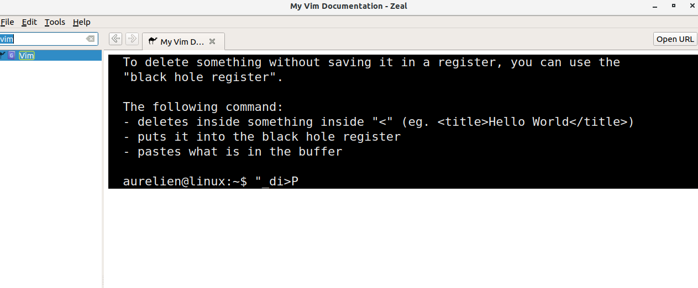

# Docsets what the hell is this?

The following tutorial is addressed to the programmers like me that use to keep own docs or shortcuts locally
and want to centralize it into a very cool document viewer so to have the possiblity to search/find it easilly as
well as when developing. The below tutorial is valid for Linux users only.

 
1. Install the viewer


```
aurelien@linux:~$ /usr/bin/sudo /usr/bin/apt-get install zeal
```

2. Install and configure your documentation 

Let's say you want your doc to be called `LocalTips`, then it's necessary to create the tree directory as following.

```
aurelien@linux:~$ /bin/mkdir -p ~/.local/share/Zeal/Zeal/docsets/LocalTips.docset/Contents/Resources/Documents
```

We'll create a first documentation on vim with our favourite commands then let's create the html file

```
aurelien@linux:~$ touch ~/.local/share/Zeal/Zeal/docsets/LocalTips.docset/Contents/Resources/Documents/vim.html
```
Of course within this file feel free to add css, write the proper stuff you are interested in.

3. Database creation

For every entry (file) you want to be referred on [zeal](https://zealdocs.org/) it is necessary to create a record within SQLlite. Let's install the client firstly: [sqlitebrower](http://sqlitebrowser.org/).
 
```
aurelien@linux:~$ /usr/bin/sudo apt install sqlitebrowser
aurelien@linux:~$ /usr/bin/sqlitebrowser
```

We need to create database and save it to `~/.local/share/Zeal/Zeal/docsets/LocalTips.docset/Contents/Resources/docSet.dsidx`
So to do this we need to create a table called `searchIndex` and and index called `anchor` on this table.


Then we can save the database on `~/.local/share/Zeal/Zeal/docsets/LocalTips.docset/Contents/Resources/docSet.dsidx`


Once this is done we just need to create 1 record with the reference of our vim html page.
In your case just create/automatize so insert whatever is necessary. 


4. See the result!

`aurelien@linux:~$ /usr/bin/zeal`



This tutorial as been realized thanks to the help of [this](https://kapeli.com/docsets#dashDocset) great `howto`.
Within this project you'll be able to see my own customization.

That's all folks! 
